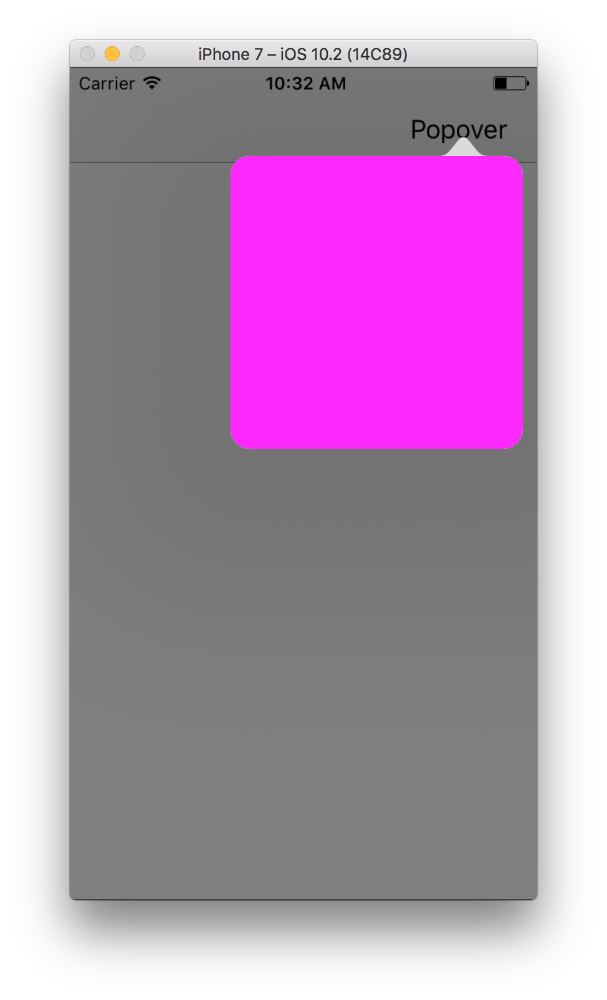

Notes on this fork:
There are a couple of display options available in KSCustomPopoverMainViewController.m  

With these settings:
  #define CUSTOM_POPOVER_BACKGROUND NO
  #define USE_DIM_BACKGROUND_VIEW YES
You'll get this:

With these settings:
  #define CUSTOM_POPOVER_BACKGROUND YES
  #define USE_DIM_BACKGROUND_VIEW NO
You'll get this:

With these settings:
  #define CUSTOM_POPOVER_BACKGROUND YES
  #define USE_DIM_BACKGROUND_VIEW YES
You'll get this:

(original readme:)
KSCustomPopover is an example project for my article: http://www.scianski.com/customizing-uipopover-with-uipopoverbackgroundview/. It shows how to customize UIPopover with images. Project is simple Utility Application template with additional KSCustomPopoverBackgroundView subclass of UIPopoverBackgroundView. This project uses features only available in iOS SDK 5.0 and later.
